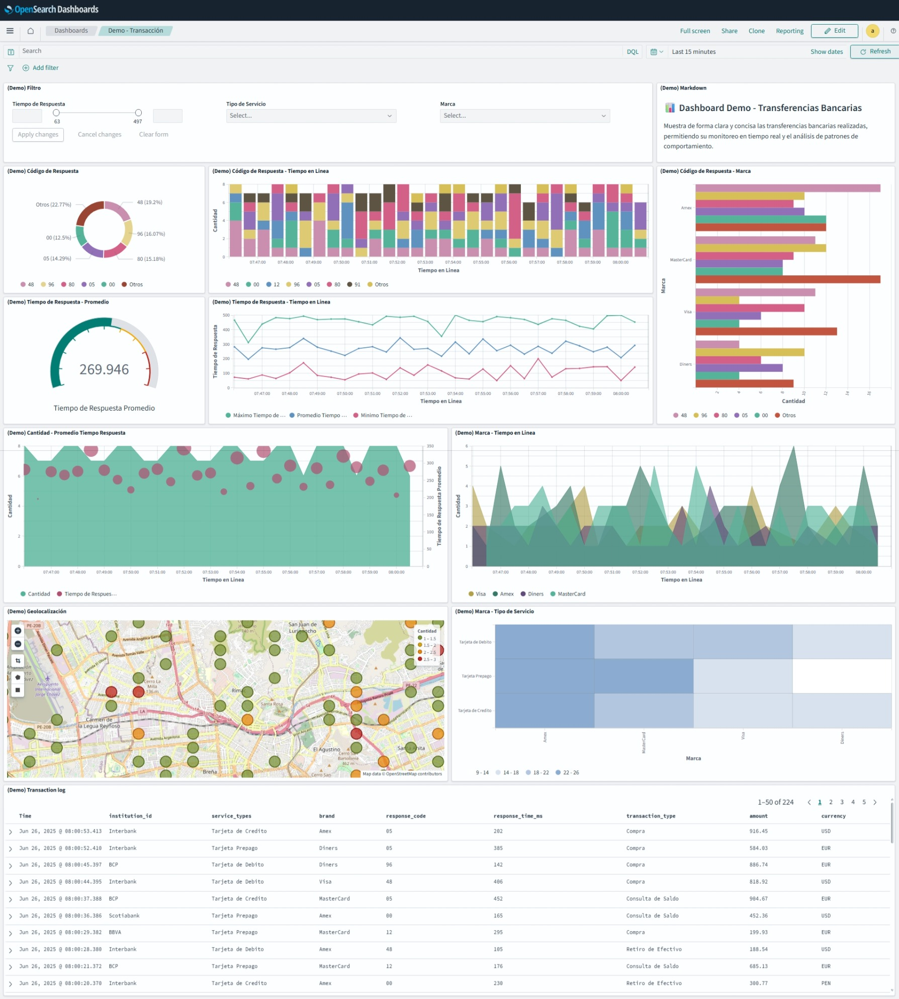

# 📊 Dataset de Transacciones Financieras

Este repositorio contiene un dataset simulado de transacciones financieras, generado dinámicamente con Python. Los datos incluyen múltiples campos categóricos y métricas clave, listos para ser indexados y visualizados en tiempo real.

---

## 🚀 Objetivo del Proyecto

El objetivo principal es demostrar un flujo completo de generación, envío y visualización de datos financieros usando herramientas del ecosistema de observabilidad:

- **Python**: para la generación continua de datos de ejemplo.
- **Filebeat**: para la recolección y envío de logs simulados a OpenSearch.
- **OpenSearch**: para el almacenamiento y análisis de los datos.
- **OpenSearch Dashboards**: para la visualización de métricas clave a través de dashboards interactivos.

Este entorno sirve como base para pruebas, aprendizaje o demostraciones relacionadas con procesamiento de logs, análisis de eventos financieros y monitoreo en tiempo real.

---

## 🚀 Explicacion del Dashboard "(Demo) Transacciones"

### 🖼️ Vista general del panel



### 📈 Funcionalidades del Dashboard

- Filtros por **Tiempo de Respuesta**, **Tipo de Servicio** y **Marca**  
- Cantidad y porcentaje de cada **Código de Respuesta**  
- Evolución de la cantidad de **Códigos de Respuesta** a lo largo del tiempo  
- Promedio general del **Tiempo de Respuesta**  
- Valores **máximo**, **promedio** y **mínimo** del **Tiempo de Respuesta** por periodo  
- Distribución de **Códigos de Respuesta** por **Marca**  
- Cantidad de transacciones y promedio del **Tiempo de Respuesta** en el tiempo  
- Distribución de cada **Marca** según el tiempo transcurrido  
- Visualización de **geolocalización** de las transacciones  
- **Mapa de calor** de **Marca** por **Tipo de Servicio**  
- **Log** detallado de todas las transacciones

### ⚙️ Tecnologías utilizadas

- OpenSearch Dashboards 
- OpenSearch Alerting
- Logstash / Beats
- Index Patterns personalizados

---

## 🧾 Formato de Trama ISO8583 Simulada

Esta función genera una línea de datos que simula una transacción financiera en formato ISO8583, con los siguientes campos:

| Campo               | Descripción                                                                 | Valores posibles / Ejemplo                             |
|---------------------|------------------------------------------------------------------------------|--------------------------------------------------------|
| `timestamp`         | Fecha y hora de la transacción (UTC)                                        | `2025-06-25T15:00:00.000Z`                             |
| `transaction_id`    | ID único de la transacción                                                  | `txn_123456789`                                        |
| `mtid`              | Message Type Identifier (tipo de mensaje ISO8583)                           | `0200` (solicitud financiera)                          |
| `response_code`     | Código de respuesta ISO8583                                                 | `"00"` (aprobada), `"05"`, `"12"`, `"91"`, `"96"`, `"80"`, `"48"` |
| `service_types`     | Tipo de tarjeta usada en la transacción                                     | `"Tarjeta de Credito"`, `"Tarjeta de Debito"`, `"Tarjeta Prepago"` |
| `institution_id`    | Entidad financiera que procesa la transacción                               | `"BCP"`, `"BBVA"`, `"Interbank"`, `"Scotiabank"`       |
| `brand`             | Marca de la tarjeta                                                         | `"Visa"`, `"MasterCard"`, `"Amex"`, `"Diners"`         |
| `transaction_type`  | Tipo de operación realizada                                                 | `"Compra"`, `"Retiro de Efectivo"`, `"Consulta de Saldo"` |
| `user_id`           | Identificador del usuario                                                   | `user_1234` (valor aleatorio entre 1000 y 9999)        |
| `currency`          | Moneda de la transacción                                                    | `"USD"`, `"EUR"`, `"PEN"`                              |
| `amount`            | Monto de la transacción (en la moneda indicada)                             | Número decimal entre `5.00` y `1000.00`                |
| `response_time_ms`  | Tiempo de respuesta del sistema en milisegundos                             | Número entero entre `50` y `500`                       |
| `lat`               | Latitud simulada para la ubicación de la transacción                        | Entre `-12.10` y `-11.95`                              |
| `lon`               | Longitud simulada para la ubicación de la transacción                       | Entre `-77.15` y `-76.95`                              |

### 🧪 Ejemplo de salida:

```bash
[timestamp] 2025-06-25T15:30:00.123456 [transaction_id] txn_834927561 [mtid] 0200 [response_code] 00 [service_types] Tarjeta de Credito [institution_id] BBVA [brand] Visa [transaction_type] Compra [user_id] user_3021 [currency] PEN [amount] 252.75 [response_time_ms] 178 [lat] -12.035217 [lon] -77.042838
```

---

# 🐳 Proyecto con Docker Compose: OpenSearch + Dashboards + Filebeat + Logstash

Este proyecto contiene una arquitectura básica usando Docker Compose para levantar un entorno con:

- Generador de logs (`generator`)
- Filebeat
- Logstash
- OpenSearch
- OpenSearch Dashboards


---

## 📦 Requisitos

- Docker
- Docker Compose v1.29+ o Docker Compose v2

---

## 📁 Estructura esperada del proyecto

```
.
├── docker-compose.yml
├── Dockerfile
├── generator/
│   ├── generateData.py
│   └── data/
│       └── transactions.log
├── filebeat/
│   └── filebeat.yml
└── logstash/
│   └── pipeline/
│       └── logstash.conf
└── import/
    ├── opensearch/
    │   └── opensearch-query.conf
    └── opensearch-dashboard/
        └── dashboard-query.conf
```

---


## 🚀 Instrucciones de uso

### 1. 📁 Clona el repositorio y ubícate en la raíz del proyecto

```bash
git clone https://github.com/QPRodrigo/MonitoreoOpensearch.git
cd MonitoreoOpensearch
```

---

### 2. 🛠️ Construye los contenedores

Desde la raíz del proyecto, ejecuta el siguiente comando para construir la imagen personalizada del generador de logs (`generator`) y descargar las demás imágenes necesarias:

```bash
docker-compose build
```
---

### 3. 🌐 Crear la red de los contenedores

Crea la red Docker que será compartida por los servicios:

```bash
docker network create opensearch-net
``` 
### 4. ▶️ Levantar los contenedores

Inicia todos los servicios definidos en el archivo `docker-compose.yml`:

```bash
docker-compose up
```
Para ejecutarlos en segundo plano (modo detached), agrega el parámetro `-d`:

```bash
docker-compose up -d
```

---

## 🛑 Detener los contenedores

```bash
docker-compose down
```

---

## 🧪 Verifica

- Abre OpenSearch Dashboards en: [http://localhost:5601](http://localhost:5601)
- Verifica que el archivo `generator/data/transactions.log` se haya generado correctamente
- Filebeat leerá ese archivo, y Logstash lo enviará a OpenSearch

---

## 👨‍💻 Credenciales por defecto

- **Usuario:** `admin`
- **Contraseña:** `Contrasena123456789$` (definida en las variables de entorno)

---